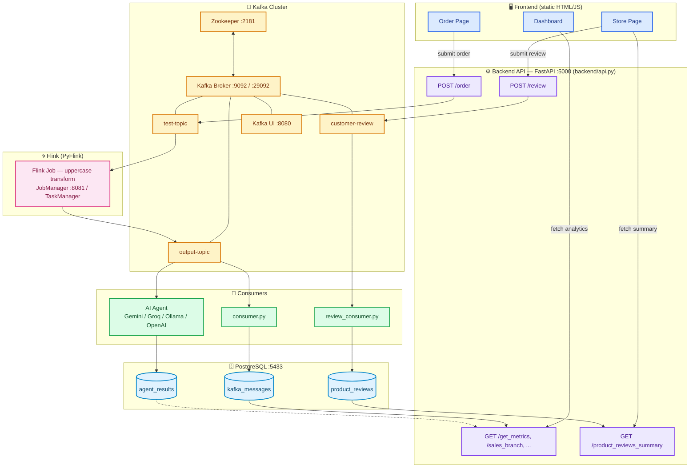

# Event Intelligence

> **This project is under active development and not yet production-ready.**

Cloud-native real-time event streaming pipeline built on Apache Kafka and Apache Flink (PyFlink), with a configurable AI agent for automated order analysis. Designed for scalable event ingestion, transformation, storage, and real-time analytics.

## Architecture



### Data Flow

1. **Ingest** -- The FastAPI backend receives orders via `POST /order` and publishes them to Kafka's `test-topic`.
2. **Transform** -- An Apache Flink (PyFlink) streaming job reads from `test-topic`, transforms each message to uppercase, and writes the result to `output-topic`.
3. **Store** -- The Dockerized consumer reads from `output-topic` and persists the original and transformed messages to PostgreSQL.
4. **Analyze** -- The AI Agent reads from `output-topic` in parallel with the consumer, analyzes each order using a configurable AI provider (Gemini, Groq, Ollama, or OpenAI -- selected via `config/agent_config.yaml`), with automatic retry and exponential backoff, and persists the analysis to PostgreSQL's `agent_results` table.
5. **Review** -- The store page lets customers submit a star rating and text review via `POST /review`, which publishes directly (no Flink transform) to the `customer-review` topic. A dedicated `review-consumer` persists each review to PostgreSQL's `product_reviews` table.
6. **Summarize** -- The AI Agent also consumes messages from `customer-review`, aggregates all reviews for the same product, generates an AI-powered review summary using the configured provider, and stores the result in PostgreSQL's `product_review_summaries` table.
7. **Serve** -- The analytics dashboard (`frontend/dashboard-page/`) reads aggregated metrics from the backend and displays them in real time. The order page (`frontend/order-page/`) lets users submit new orders, and the store page (`frontend/store-page/`) lets users submit and browse product reviews.
8. **Seed** -- A startup seed script inserts initial demo order records and ensures that all predefined product review seed records exist. Missing review seed records are added automatically without duplicating existing reviews.
9. **Initial Review Summaries** -- On startup, the AI Agent checks the seeded product reviews and generates initial AI review summaries when an AI provider is available. If no provider is available, the Agent skips initial summary generation gracefully and continues running normally.

### Services

| Service | Image / Build | Port(s) | Purpose |
|---|---|---|---|
| Zookeeper | `confluentinc/cp-zookeeper:7.5.0` | 2181 | Kafka coordination |
| Kafka | `confluentinc/cp-kafka:7.6.0` | 9092, 29092 | Message broker |
| Kafka Init | `confluentinc/cp-kafka:7.5.0` (startup helper) | -- | One-time job that creates `test-topic`, `output-topic`, and `customer-review` before Flink starts |
| Producer API | Custom (`Dockerfile`) | 5000 | FastAPI REST API (`backend/api.py`): receives orders/reviews, exposes dashboard + review-summary endpoints |
| Flink JobManager | `flink:1.18-java11` | 8081 | Flink cluster coordinator |
| Flink TaskManager | `flink:1.18-java11` | -- | Flink task execution (2 task slots) |
| Flink Job | Custom (`flink-job/Dockerfile`) | -- | PyFlink stream transformation job |
| Kafka UI | `provectuslabs/kafka-ui:latest` | 8080 | Kafka topic monitoring |
| PostgreSQL | `postgres:16-alpine` | 5433 → 5432 | Persistent storage |
| Consumer | Custom (`Dockerfile`) | -- | Reads `output-topic`, writes raw + transformed messages to PostgreSQL |
| AI Agent | Custom (`Dockerfile`) | -- | Reads output-topic and customer-review, analyzes customer orders, generates AI-powered product review summaries, and stores results in PostgreSQL. |
| Review Consumer | Custom (`Dockerfile`) | -- | Reads `customer-review`, writes ratings + review text to PostgreSQL's `product_reviews` table |
| DB Seed | Custom (`Dockerfile`) | -- | Inserts demo rows once at startup, only if the table is empty |

## Prerequisites

- [Docker](https://docs.docker.com/get-docker/) and Docker Compose
- An API key for at least one supported AI provider (Gemini, Groq, or OpenAI), **or** a running local [Ollama](https://ollama.com/) instance -- see [AI Agent](#ai-agent) below
- [Python 3.11+](https://www.python.org/downloads/) -- only needed to run the test suite locally outside Docker (see [Testing](#testing))

## Getting Started

### 1. Configure the AI Agent provider

Open `config/agent_config.yaml`, configure the available providers, and set `provider_routing_order` to define the order in which the AI Agent should try them. Also configure `request_timeout_seconds` and `max_retries_per_provider` as needed. See [AI Agent](#ai-agent) for full details.

> ⚠️ **Never commit a real API key.** The file is tracked with placeholder values (e.g. `PUT_YOUR_GEMINI_API_KEY`) -- fill in real keys locally only, and make sure they are removed again before pushing.

### 2. Start the full stack

```bash
docker compose -f docker_compose.yaml up --build -d
```

This single command starts every service: Zookeeper, Kafka, Kafka Init, the Flink cluster and job, the Producer API, the Consumer, the AI Agent, PostgreSQL, and the DB Seed job, plus Kafka UI. Everything runs inside containers -- no manual `pip install` or separately running a script is required.

### 3. Allow a short warm-up period

Kafka, the Flink job, and the AI Agent all need a few seconds to finish initializing. `consumer` and `agent` both have `restart: on-failure`, so they retry automatically if they start before Kafka is fully ready.

`flink-job`, however, has `restart: "no"` -- if it fails to connect to Kafka on its very first attempt, it stops permanently instead of retrying. If the Flink Dashboard (see below) shows 0 running jobs after start-up, restart it manually:

```bash
docker compose -f docker_compose.yaml up -d flink-job
```

### 4. Verify services are running

```bash
docker compose -f docker_compose.yaml ps
```

Check the dashboards:

- **Producer API docs**: http://localhost:5000/docs
- **Flink Dashboard**: http://localhost:8081 (confirm a job is listed under *Running Jobs*)
- **Kafka UI**: http://localhost:8080

### 5. Submit a test order

```bash
curl -X POST http://localhost:5000/order \
  -H "Content-Type: application/json" \
  -d '{
    "branch": "Gaza",
    "customer_name": "Test Customer",
    "payment_method": "Cash",
    "notes": "Test order",
    "items": [
      {"product_id": "E1004", "product_name": "Gaming Mouse", "quantity": 1, "unit_price": 150}
    ]
  }'
```

The order flows through the full pipeline: Producer API → Kafka (`test-topic`) → Flink (uppercase transform) → `output-topic` → Consumer (→ PostgreSQL) and AI Agent (→ PostgreSQL) in parallel.

### 6. Query stored results

```bash
docker exec -it postgres psql -U admin -d kafka_events -c "SELECT * FROM kafka_messages ORDER BY id DESC LIMIT 5;"
docker exec -it postgres psql -U admin -d kafka_events -c "SELECT * FROM agent_results ORDER BY id DESC LIMIT 5;"
```

Or open the analytics dashboard directly -- see [Frontend Interfaces](#frontend-interfaces).

## Project Structure

```
event-intelligence/
├── backend/
│   ├── dashboard_utils.py    # Parsing/aggregation logic used by the dashboard endpoints
│   └── api.py                # FastAPI app: order-creation (Kafka) + dashboard analytics endpoints
├── config/
│   └── agent_config.yaml     # AI provider routing, retries, timeout, and provider configuration
├── frontend/
│   ├── dashboard-page/         # Static real-time analytics dashboard
│   │   ├── index.html
│   │   ├── script.js
│   │   └── style.css
│   ├── order-page/
│   │   ├── images/
│   │   ├── index.html
│   │   ├── script.js
│   │   └── style.css
│   └── store-page/
│       ├── images/
│       ├── index.html
│       ├── script.js
│       └── style.css
├── docs/
│   ├── INFRASTRUCTURE.md     # Infrastructure decisions & benchmarking notes
│   └── README.md             
├── flink-job/
│   ├── Dockerfile
│   └── flink_job.py
├── scripts/
│   ├── agent.py              # AI Agent: consumes orders and reviews, supports provider routing, failover, and AI review summarization
│   ├── consumer.py           # Kafka consumer, persists to PostgreSQL
│   ├── review_consumer.py    # Consumes customer-review messages and stores product reviews
│   └── seed.py                # Inserts demo records into PostgreSQL on first run
├── sql/
│   └── init.sql              # PostgreSQL schema (kafka_messages, agent_results)
├── tests/
│   ├── test_dashboard_utils.py
│   ├── test_integration_pipeline.py
│   ├── test_producer.py
│   ├── test_producer_api.py
│   └── test_seed.py
├── Dockerfile                 # Producer API / consumer / agent / db-seed container image
├── docker_compose.yaml       # Full stack orchestration
├── pytest.ini                 # pytest configuration (import paths, markers)
├── requirements.txt          # Python dependencies
└── LICENSE
```

## API Reference

All endpoints are served by the API (`backend/api.py`) on port `5000`.

### `POST /order`

Submit a new order to the Kafka pipeline.

**Request body:**
```json
{
  "branch": "Gaza",
  "customer_name": "Ahmad",
  "payment_method": "Cash",
  "notes": "Urgent delivery",
  "items": [
    {"product_id": "E1004", "product_name": "Gaming Mouse", "quantity": 1, "unit_price": 150}
  ]
}
```

**Response:**
```json
{
  "status": "success",
  "message": "Order sent to Kafka",
  "topic": "test-topic",
  "partition": 0,
  "offset": 1
}
```

### `GET /health`

Health check endpoint. Returns `{"status": "healthy"}`.

### `GET /get_metrics`

Returns aggregated dashboard metrics: total orders, revenue, products sold, number of branches, and the last-updated timestamp.

### `GET /latest_orders`

Returns the most recent orders (parsed into structured fields), newest first.

### `GET /sales_branch`

Returns total sales aggregated per branch.

### `GET /branch_performance`

Returns per-branch statistics: order count, revenue, products sold, and average order value.

### `GET /sales_by_payment`

Returns total sales aggregated by payment method.

### `GET /agent_results`

Returns the most recent AI-generated analyses for real customer orders processed by the AI Agent. Results are retrieved from the `agent_results` table and displayed in the analytics dashboard.

### `POST /review`

Submits a product review from the Store page to the `customer-review` Kafka topic for asynchronous processing.

**Request body:**

```json
{
  "product_id": "E1002",
  "product_name": "Anker Power Bank",
  "customer_name": "Ahmad",
  "rating": 4,
  "review_text": "Good quality and fast charging."
}
```

**Response:**

```json
{
  "status": "success",
  "message": "Review sent to Kafka",
  "topic": "customer-review",
  "partition": 0,
  "offset": 1
}
```

### `GET /product_reviews_summary`

Returns product review statistics, including:

- Average rating
- Review count
- Recent customer reviews
- AI-generated review summary
- AI provider used to generate the summary

## AI Agent

The AI Agent (`scripts/agent.py`) is a Dockerized Python service that consumes processed orders from `output-topic` and product reviews from `customer-review`. It performs AI-powered order analysis and product review summarization using a configurable multi-provider routing system, then stores the generated results in PostgreSQL.

### Provider-agnostic design

Instead of being tied to a single AI provider, the agent is configured through `config/agent_config.yaml` and uses a provider routing order. All supported providers are handled through one general function, `analyze_with_provider(prompt, provider_name)`, so adding or selecting a provider does not require creating a separate analysis function for each model.

```yaml
provider_routing_order:
  - gemini
  - groq
  - ollama
  - openai

request_timeout_seconds: 3
max_retries_per_provider: 2

providers:
  gemini:
    api_key: "..."
    model: "gemini-..."

  groq:
    api_key: "..."
    model: "llama-..."

  ollama:
    url: "http://<your-ollama-host>:11434/api/generate"
    model: "llama3:latest"

  openai:
    api_key: "..."
    model: "gpt-4o-mini"
```

Switching providers requires no code changes. Simply update the `provider_routing_order` or the provider configuration in `config/agent_config.yaml`, then restart the `agent` container.

### AI Review Summarization

Besides analyzing customer orders, the AI Agent also processes product reviews streamed through the `customer-review` Kafka topic.

For every incoming review, the agent:

1. Retrieves all existing reviews for the same product from PostgreSQL.
2. Includes the newly submitted review.
3. Generates a concise AI-powered summary using the selected provider.
4. Stores the generated summary, provider name, review count, and update timestamp in the `product_review_summaries` table.

The Store page retrieves this summary through the backend API and displays it alongside the average rating and recent customer reviews.

On startup, the Agent also checks for existing product reviews and generates initial summaries so seeded reviews can have AI analysis before a customer submits a new review. If no AI provider is currently available, initial summary generation is stopped gracefully while the Agent continues running and remains available to process future Kafka messages.

When a customer later submits a new review, the Agent reprocesses the product's reviews and updates the stored summary with the latest review data.

### Provider routing and failover

Instead of relying on a single active provider, the AI Agent follows the configured `provider_routing_order`. If the current provider fails after the configured retry attempts, the request is automatically forwarded to the next available provider until a response is generated or all providers fail.

### Reliability

Each provider request uses configurable timeout and retry settings (`request_timeout_seconds` and `max_retries_per_provider`). Failed requests are retried before the agent automatically switches to the next provider in the routing order.

### Supported providers

The current implementation supports:

- Gemini
- Groq
- Ollama
- OpenAI

### Security note

`config/agent_config.yaml` is committed with **placeholder values only** (e.g. `PUT_YOUR_GEMINI_API_KEY`). Fill in real keys locally, and double-check they are removed again before pushing. Moving these credentials to a git-ignored `.env` file is a recommended future improvement to reduce the risk of accidentally committing a real key.

### Query AI analysis results

```bash
docker exec -it postgres psql -U admin -d kafka_events -c "SELECT * FROM agent_results ORDER BY id DESC LIMIT 5;"
```

## Frontend Interfaces

The project includes three independent static front-end interfaces, all built with plain HTML/CSS/JS (no build step) and connected to the Producer API at `http://localhost:5000`.

### `frontend/dashboard-page/` -- Analytics Dashboard

A read-only, real-time monitoring view. On load it calls `/get_metrics`, `/sales_branch`, `/latest_orders`, `/branch_performance`, and `/agent_results`, and renders:
- Summary cards (total orders, revenue, products, branches)
- A pie chart of sales by branch (Chart.js)
- A live feed of the most recent orders
- A branch-performance comparison table
- Live AI Agent Insights showing AI-generated analyses for real customer orders processed by the Agent

### `frontend/order-page/` -- Order Submission Page

A simple customer-facing form for placing new orders. It lets a user pick a branch, payment method, and product quantities, previews the JSON payload before sending, and submits it via `POST /order`.

### `frontend/store-page/` -- Product Store

A customer-facing product catalog that allows users to:

- Browse available products.
- Submit star ratings and text reviews.
- View recent customer reviews.
- View average product ratings.
- View AI-generated review summaries produced by the AI Agent, including the provider used to generate each summary.

## Testing

The project uses `pytest`, split into two categories.

### Unit tests (29 tests, no infrastructure required)

Cover the pure logic in `dashboard_utils.py`, `api.py`, and `seed.py`, plus the FastAPI endpoints (Kafka calls are mocked, so these run instantly without Docker):

```bash
pytest -v
```

| File | What it covers |
|---|---|
| `test_dashboard_utils.py` | Order/message parsing, metrics calculation, sales/branch aggregation, latest-orders sorting |
| `test_producer.py` | Order message formatting |
| `test_producer_api.py` | `/health` and `/order` endpoints (success, validation error, Kafka failure) |
| `test_seed.py` | Demo message generation matches the expected parsing format |

### Integration test (1 test, requires the full Docker stack running)

Verifies the complete pipeline end-to-end: sends a real order through `POST /order`, polls PostgreSQL until it appears (or times out after 30 seconds), and cleans up the test record afterward.

```bash
docker compose -f docker_compose.yaml up -d
pytest -v -m integration
```

By default, plain `pytest -v` automatically skips this test (see `pytest.ini`), so day-to-day development does not require Docker to be running.

## Stopping the Stack

```bash
docker compose -f docker_compose.yaml down
```

To also remove volumes (deletes stored data):

```bash
docker compose -f docker_compose.yaml down -v
```

## License

This project is licensed under the Apache License 2.0. See [LICENSE](LICENSE) for details.